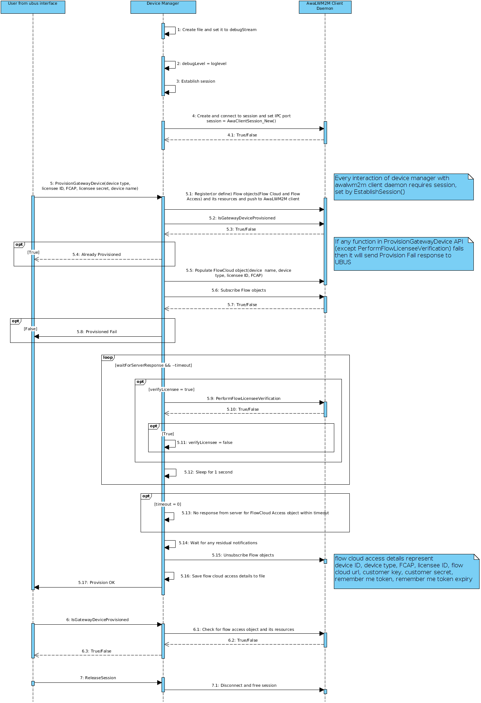

## Device Manager
Device Manager application is used to provision the gateway device and constrained devices with access details to register with the FlowCloud. It runs on the gateway device and uses the Awalwm2m sdk to communicate with the awalwm2m server and client running on the same.
Currently it can be used to :
- Provision the gateway device
- Check if the gateway device is provisioned or not
- Provision the constrained device
- Check if the constrained device is provisioned or not
- List the constrained devices connected to the local server

## Revision History
| Revision  | Changes from previous revision |
| :----     | :------------------------------|
| 0.9.0     | External Beta Trial Release    |

## Prerequisites
Prior to running device manager, make sure that:
- Awalwm2m client daemon(awa_clientd) is running.
- Awalwm2m server daemon(awa_serverd) is running.

**NOTE:** Please do "ps" on console to see "specific" process is running or not.

## Application flow diagram


## Using the ubus interface of Device Manager
### Provisioning the gateway device:

```
root@OpenWrt:/# ubus -t 60 call device_manager provision_gateway_device '{"device_name":"MyCi40","device_type":"FlowGateway","licensee_id":7,"fcap":"XXXXXXXXXX", "licensee_secret":"XXXXXXXXXXXXXX"}'
{
        "provision_status": 0
}
```
Status 0 : The device was provisioned successfully.
Status 1 : Provisoning failed
Status 2 : The device was already provisioned.

### Checking if the gateway device is provisioned or not
```
root@OpenWrt:/# ubus call device_manager is_gateway_device_provisioned
{
        "provision_status": false
}
```

### Listing the devices connected to the gateway device
```
root@OpenWrt:/# ubus call device_manager get_client_list
{
        "clients": [
                {
                        "clientId": "LedDevice",
                        "is_device_provisioned": false
                }
        ]
}
```

### Provisioning a constrained device:
```
root@OpenWrt:/# ubus -t 60 call device_manager provision_constrained_device '{"fcap":"XXXXXXXXXX", "client_id":"LedDevice", "licensee_id": 7, "device_type" : "FlowCreatorLED", "parent_id": "08 5A 24 DE A8 C2 0A 4B AB 24 4C F6 ED 5D 5F 62 "}'
{
        "status": 0
}
```
**NOTE:** The parent id should be the same as the device id of the gateway device. It can be read from /etc/lwm2m/flow_access.cfg

### Checking if the constrained device is provisioned or not
```
root@OpenWrt:/# ubus call device_manager is_constrained_device_provisioned '{"client_id":"LedDevice"}'
{
        "provision_status": false
}

```

## Debugging

The logs of device manager application can be found at /var/log/device_manager_ubusd

## API guide

Device Manager documentation is available as a Doxygen presentation which is generated via the following process.

  1. Install [Doxygen ](http://www.stack.nl/~dimitri/doxygen/download.html): ```` sudo apt-get install doxygen````
  2. Generate the documentation:

        $ device-manager: mkdir build
        $ device-manager/build: cd build
        $ device-manager/build: cmake ../docs
        $ device-manager/build: make docs

The output can be found in the build/html directory and viewed by opening index.html with your web browser.
